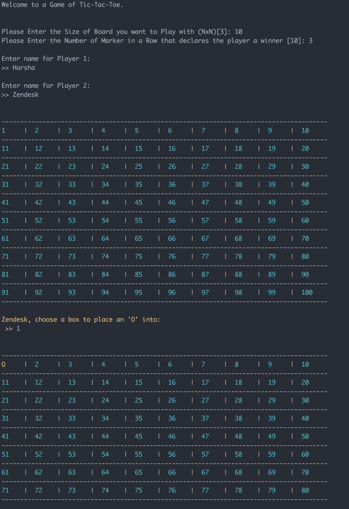

# NxN - Tic Tac Toe

[](https://www.codacy.com/app/harsha2k4/nxn-tic-tac-toe?utm_source=github.com&amp;utm_medium=referral&amp;utm_content=harshanarayana/nxn-tic-tac-toe&amp;utm_campaign=Badge_Grade)
[](https://www.codacy.com/app/harsha2k4/nxn-tic-tac-toe?utm_source=github.com&utm_medium=referral&utm_content=harshanarayana/nxn-tic-tac-toe&utm_campaign=Badge_Coverage)
[](https://www.codefactor.io/repository/github/harshanarayana/nxn-tic-tac-toe)

# Setup
## Requirements
1. Python 3.6.5 or higher. Preferably [Anaconda](https://www.anaconda.com/download/) v3.6
2. [Contracts](https://github.com/deadpixi/contracts) Provides Type safe runtime checks.

## Pre-Requisite
1. Install and setup Python 3.6.5 or higher.


## Installation
```bash
# Create Virtual ENV
conda create -n zendesk python=3.6.5 anaconda

# Activate VirtualEnv
source activate zendesk

# Install Tic-Tac-Toe
pip install -r requirements.txt
pip install -e .

```

# Running the Game
Navigate to the directory that contains the copy of the Git Code and run the follwing. 

```bash
python tic-tac-toe.py
``` 

# Run Game Using Docker
``bash
# Start the Docker Image by building it if necessary
docker-compose up

# Find the Docker Process with Container Name "tic-tac-toe"
docker ps 

# Start the Game
docker exec -it <container_number> tic-tac-toe
``

After running the command, please follow CLI prompts for helper information.

# Screenshots

